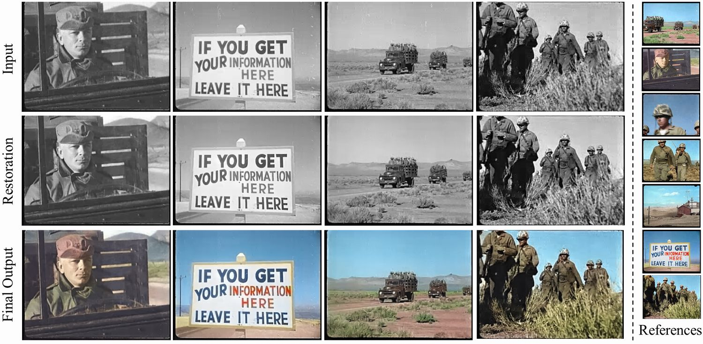

# [DeepRemaster: Temporal Source-Reference Attention Networks for Comprehensive Video Enhancement](http://hi.cs.waseda.ac.jp/~iizuka/projects/remastering/)

[Satoshi Iizuka](http://iizuka.cs.tsukuba.ac.jp/index_eng.html) and [Edgar Simo-Serra](https://esslab.jp/~ess/)



## Overview

This code provides an implementation of the research paper:

```
  "DeepRemaster: Temporal Source-Reference Attention Networks for Comprehensive Video Enhancement"
  Satoshi Iizuka and Edgar Simo-Serra
  ACM Transaction on Graphics (Proc. of SIGGRAPH ASIA 2019), 2019
```
We learn to semi-automatically remaster vintage videos with a deep convolutional network.
Our network is based on temporal convolutions with source-reference attention mechanisms
trained on videos with example-based deterioration simulation, which allows us to automatically
remove film noises, improve contrast and sharpness, and add color based on reference color frames created manually.
See our [project page](http://iizuka.cs.tsukuba.ac.jp/projects/remastering/) for more detailed information.

## License

```
  Copyright (C) <2019> <Satoshi Iizuka and Edgar Simo-Serra>

  This work is licensed under the Creative Commons
  Attribution-NonCommercial-ShareAlike 4.0 International License. To view a copy
  of this license, visit http://creativecommons.org/licenses/by-nc-sa/4.0/ or
  send a letter to Creative Commons, PO Box 1866, Mountain View, CA 94042, USA.

  Satoshi Iizuka, University of Tsukuba
  iizuka@cs.tsukuba.ac.jp, http://iizuka.cs.tsukuba.ac.jp/index_eng.html
  
  Edgar Simo-Serra, Waseda University
  ess@waseda.jp, https://esslab.jp/~ess/
```


## Dependencies

- [PyTorch (0.4.1+)](https://pytorch.org/) [torchvision](https://pytorch.org/docs/master/torchvision/)
- [FFmpeg (requires to be configured with --enable-libx264)](https://ffmpeg.org/)
- [opencv (3.4.1+)](https://opencv.org/)
- [scikit-image](https://scikit-image.org/)
- [tqdm](https://github.com/tqdm/tqdm)

For information on how to install PyTorch, please refer to the [PyTorch website](https://pytorch.org/). FFmpeg should be installed with libx264 support, which can be installed in Anaconda by using <code>conda install x264 ffmpeg -c conda-forge</code>.

## Usage

First, download the model by running the download script:

```
bash download_model.sh
```

Basic usage is:

```
python remaster.py --input <input_video> --reference_dir <directory_of_reference_images>
```

The input video will be automatically restored and colorized based on the reference color frames using the model. If you want to perform restoration only, use <code>--disable_colorization</code> option.

Other options:

- `--gpu`: Use GPU for the computation (**recommended**). Defaults to false.
- `--disable_colorization`: Disable colorization and only perform restoration with enhancement. Defaults to false.
- `--mindim`: Minimum edge dimension of the input video. Defaults to 320.

For example:

```
python remaster.py --input example/a-bomb_blast_effects_part.mp4 --reference_dir example/references --gpu
```

### Preparing Reference Images

To prepare reference color images for your own video, it is recommended to first extract reference frames from the video using a scene detection technique such as [pyscenedetect](https://pyscenedetect.readthedocs.io/en/latest/). Afterwards, colorize them by leveraging image editing software or recent interactive colorization techniques such as the [Interactive Deep Colorization [Zhang et al. 2017]](https://github.com/junyanz/interactive-deep-colorization/).

### Notes

- This is developed on a Linux machine running Ubuntu 18.04 during late 2018.
- We recommend using GPU with 4GB+ memory for fast computation.
- Provided model and sample code are under a non-commercial creative commons license.

## Dataset

The list of video URLs used for training the model is available [here](http://iizuka.cs.tsukuba.ac.jp/projects/remastering/data/video_urls.zip) (unfortunately several links are no longer available).


## Citing

If you use this code please cite:

```
@Article{IizukaSIGGRAPHASIA2019,
  author = {Satoshi Iizuka and Edgar Simo-Serra},
  title = {{DeepRemaster: Temporal Source-Reference Attention Networks for Comprehensive Video Enhancement}},
  journal = "ACM Transactions on Graphics (Proc. of SIGGRAPH ASIA)",
  year = 2019,
  volume = 38,
  number = 6,
  pages = 1--13,
  articleno = 176,
}
```


